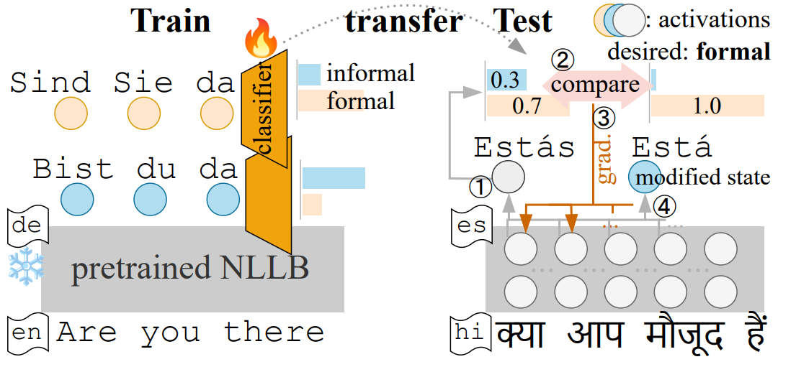

# How Transferable are Attribute Controllers on Pretrained Multilingual Translation Models?
Implementation for [paper]() with the same title.

## Introduction
Our implementation is based on the [nllb branch](https://github.com/facebookresearch/fairseq/tree/nllb) of Fairseq.

The dependencies are the same as for [nllb](https://github.com/facebookresearch/fairseq/blob/nllb/INSTALL.md).

Our main implementation is in
`./fairseq-nllb/examples/classifier_guidance` and 
`./fairseq-nllb/fairseq/sequence_generator_classifier_guidance.py`.

## Models

## Trained Models

| Control Task       | Approach   | Trained on           | Link                                                           |
|--------------------|------------|----------------------|----------------------------------------------------------------|
| Grammatical gender | Finetuning | en->es               | [feminine](https://bwsyncandshare.kit.edu/s/oiBFfXnr8jXKS2D), [masculine](https://bwsyncandshare.kit.edu/s/3RRyLEXKEtmaqPT) | 
| Formality          | Finetuning | en->{de,es,fr,hi,it} | [formal](), [informal]()|
(_More models to be uploaded soon_)

## Data and Preprocessing
Please see [here](./data_prepro.md).

## Preparing Pretrained Model
We initialize from the NLLB-200 [distilled 600M model](https://github.com/facebookresearch/fairseq/tree/nllb#multilingual-translation-models).

Download and unpack model:
```bash
MODEL_FOLDER=# define path to store pretrained models, e.g. $HOME/projects/nllb/model
cd $MODEL_FOLDER 
wget https://tinyurl.com/nllb200densedst600mcheckpoint  # model checkpoint
wget https://tinyurl.com/flores200sacrebleuspm  # sentencepiece model
wget https://tinyurl.com/nllb200dictionary  # dictionary
wget https://raw.githubusercontent.com/dannigt/attribute-controller-transfer/main/data/langs.txt  # language list
```

## Training

### Finetuning
Finetune on attribute-specific data:
```bash
bash ./scripts/run_finetune_{formality,gender}.sh
```

### Classifier Guidance


Here we first keep the pretrained model frozen and train a classifier for attributes based on decoder hidden states.

Later at inference-time, the classifier prediction guides the generation towards wanted attributes.

#### Formality Classifier

We can change the language pair(s) used for training the classifier by modifying `lang_pairs` and `valid_lang_pairs`.
  
To train the 5-language multilingual classifier used in our experiments, use 
```bash
lang_pairs="eng_Latn-deu_Latn,eng_Latn-spa_Latn,eng_Latn-fra_Latn,eng_Latn-hin_Deva,eng_Latn-ita_Latn"
valid_lang_pairs="eng_Latn-deu_Latn,eng_Latn-spa_Latn,eng_Latn-fra_Latn,eng_Latn-hin_Deva,eng_Latn-ita_Latn"
```

<details>
<summary><b> Training script </b></summary>

```bash
#!/bin/bash

GPU=0,1,2,3
path_2_data=$HOME/projects/classifier_guidance/data/CoCoA-MT/prepro/bin
# Path to pretrained NLLB-200 model 
PRETRAINED_MODEL=$HOME/projects/nllb/model/nllb200densedst600mcheckpoint

pooling="dec-cumsum"
save_dir=$HOME/projects/classifier_guidance/model/formality.de.$pooling
mkdir -p $save_dir

lr=0.002

MODEL_FOLDER=$HOME/projects/nllb/model
lang_list=$MODEL_FOLDER/"langs.txt"

lang_pairs="eng_Latn-deu_Latn"
valid_lang_pairs="eng_Latn-deu_Latn"

batch_size=8192
CUDA_VISIBLE_DEVICES=$GPU fairseq-train $path_2_data \
    --user-dir examples/classifier_guidance/classifier_guidance_src \
    --save-dir $save_dir \
    --arch classifier_guided_transformer \
    --encoder-normalize-before --decoder-normalize-before \
    --encoder-layers 12 --decoder-layers 12 \
    --encoder-attention-heads 16 --decoder-attention-heads 16 \
    --encoder-embed-dim 1024 --decoder-embed-dim 1024 \
    --encoder-ffn-embed-dim 4096 --decoder-ffn-embed-dim 4096 \
    --task classifier_guidance \
    --lang-pairs $lang_pairs \
    --valid-lang-pairs $valid_lang_pairs \
    --langs $lang_list \
    --share-all-embeddings \
    --add-data-source-prefix-tags \
    --finetune-from-model $PRETRAINED_MODEL \
    --max-source-positions 512 --max-target-positions 512 \
    --criterion attribute_classification_cross_entropy \
    --classifier-input $pooling \
    --label-smoothing 0.1 \
    --optimizer adam --adam-betas '(0.9, 0.98)' \
    --lr-scheduler inverse_sqrt \
    --lr $lr \
    --warmup-init-lr 1e-07 \
    --stop-min-lr 1e-09 \
    --warmup-updates 20 \
    --max-update 100 \
    --max-tokens $batch_size \
    --update-freq 1 \
    --seed 1 \
    --no-epoch-checkpoints \
    --dropout 0.1 \
    --attention-dropout 0.1 \
    --encoder-langtok "src" \
    --decoder-langtok \
    --validate-interval-updates 1000 \
    --log-interval 100 \
    --save-interval-updates 5 \
    --left-pad-source False \
    --classifier-output-size 2 \
    --report-accuracy \
    --keep-last-epochs 1 \
    --keep-interval-updates 1 \
    --train-with-epoch-remainder-batch \
    --fp16 2>&1 | tee -a $save_dir/train.log
```
</details>

#### Grammatical Gender Classifier

The differences to the formality classifier are the following:
* `--classifier-output-size` is 3 (feminine, masculine, neutral).
* `--max-update` is 25.


<details>
<summary><b> Training script </b></summary>

```bash
#!/bin/bash

GPU=0,1,2,3
path_2_data=$HOME/projects/classifier_guidance/data/gender/prepro/bin_wneutral/en-es
PRETRAINED_MODEL=$HOME/projects/nllb/model/nllb200densedst600mcheckpoint

pooling="dec-meanpool"
save_dir=$HOME/projects/classifier_guidance/model/gender.es.$pooling.wneutral
mkdir -p $save_dir

lr=0.002

MODEL_FOLDER=$HOME/projects/nllb/model
lang_list=$MODEL_FOLDER/"langs.txt"

lang_pairs="eng_Latn-spa_Latn"
valid_lang_pairs="eng_Latn-spa_Latn"

batch_size=8192

CUDA_VISIBLE_DEVICES=$GPU fairseq-train $path_2_data \
    --user-dir examples/classifier_guidance/classifier_guidance_src \
    --save-dir $save_dir \
    --arch classifier_guided_transformer \
    --encoder-normalize-before --decoder-normalize-before \
    --encoder-layers 12 --decoder-layers 12 \
    --encoder-attention-heads 16 --decoder-attention-heads 16 \
    --encoder-embed-dim 1024 --decoder-embed-dim 1024 \
    --encoder-ffn-embed-dim 4096 --decoder-ffn-embed-dim 4096 \
    --encoder-layers 12 --decoder-layers 12 \
    --encoder-attention-heads 16 --decoder-attention-heads 16 \
    --encoder-embed-dim 1024 --decoder-embed-dim 1024 \
    --encoder-ffn-embed-dim 4096 --decoder-ffn-embed-dim 4096 \
    --task classifier_guidance \
    --lang-pairs $lang_pairs \
    --valid-lang-pairs $valid_lang_pairs \
    --langs $lang_list \
    --share-all-embeddings \
    --add-data-source-prefix-tags \
    --finetune-from-model $PRETRAINED_MODEL \
    --max-source-positions 512 --max-target-positions 512 \
    --criterion attribute_classification_cross_entropy \
    --classifier-input $pooling \
    --label-smoothing 0.1 \
    --optimizer adam --adam-betas '(0.9, 0.98)' \
    --lr-scheduler inverse_sqrt \
    --lr $lr \
    --warmup-init-lr 1e-07 \
    --stop-min-lr 1e-09 \
    --warmup-updates 20 \
    --max-update 25 \
    --max-tokens $batch_size \
    --update-freq 1 \
    --seed 1 \
    --no-epoch-checkpoints \
    --dropout 0.1 \
    --attention-dropout 0.1 \
    --encoder-langtok "src" \
    --decoder-langtok \
    --validate-interval-updates 1000 \
    --log-interval 100 \
    --save-interval-updates 5 \
    --left-pad-source False \
    --classifier-output-size 3 \
    --report-accuracy \
    --keep-last-epochs 1 \
    --keep-interval-updates 1 \
    --train-with-epoch-remainder-batch \
    --fp16 2>&1 | tee -a $save_dir/train.log
```
</details>

## Decoding
### (Finetuned) NLLB
The script for decoding NLLB out of the box or a finetuned NLLB share the same structure.

<details>
<summary><b> Decoding script </b></summary>

```bash
MODEL_FOLDER= #as described earlier in "Preparing Pretrained Model", e.g. $HOME/projects/nllb/model 
ckpt_name="nllb200densedst600mcheckpoint"
ckpt=$MODEL_FOLDER/$ckpt_name
spm_name="flores200sacrebleuspm"
dict=$MODEL_FOLDER/nllb200dictionary
lang_list=$MODEL_FOLDER/"langs.txt"
GPUS=0

inputf=# input file, w/ input sentences line by line

for sl in eng_Latn; do
for lang in deu_Latn; do

cat $inputf | spm_encode --model $MODEL_FOLDER/$spm_name | \
CUDA_VISIBLE_DEVICES=$GPUS fairseq-interactive ./ \
--input - \
-s $sl -t $tl \
--path $ckpt \
--batch-size 1024 --max-tokens 8192 --buffer-size 100000 \
--remove-bpe 'sentencepiece' \
--beam 4 --lenpen 1.0 \
--fixed-dictionary $dict \
--task translation_multi_simple_epoch \
--decoder-langtok --encoder-langtok src \
--langs $(cat $lang_list) \
--fp16 \
--lang-pairs $sl-$tl \
--add-data-source-prefix-tags 2>&1

done
done
```
</details>


### Decode with Classifier Guidance
Change standard decoding command to the following:

<details>
<summary><b> Decoding script </b></summary>

```bash
ckpt=# path to frozen NLLB trained with classifier
# desired attribute label index
# formality control: 1 for formal, 2 for informal
# grammatical gender controls: 1 for feminine, 2 for masculine, 3 for neutral
wanted=1 
step=0.1
niter=5

cat $inputf | spm_encode --model $MODEL_FOLDER/$spm_name | \
CUDA_VISIBLE_DEVICES=0 fairseq-interactive ./ \
--user-dir examples/classifier_guidance/classifier_guidance_src \
--input - \
-s $sl -t $tl \
--path $ckpt \
--batch-size 256 --max-tokens 20480 --buffer-size 100000 \
--remove-bpe 'sentencepiece' \
--beam 4 --lenpen 1.0 \
--fixed-dictionary $dict \
--task classifier_guidance \
--wanted-label $wanted \
--kl-scale 0 \
--step-size $step \
--num-iter $niter \
--decoder-langtok --encoder-langtok src \
--langs $(cat $lang_list) \
--fp16 \
--lang-pairs $sl-$tl --add-data-source-prefix-tags 2>&1
```
</details>

The differences to the standard script are:
* `--user-dir examples/classifier_guidance/classifier_guidance_src`: add user directory
* `--task classifier_guidance`: use task for classifier guidance
* `--wanted-label $wanted`: label index for the desired attribute
* `--step-size`: gradient update step size
* `--num-iter`: number iterations for gradient update